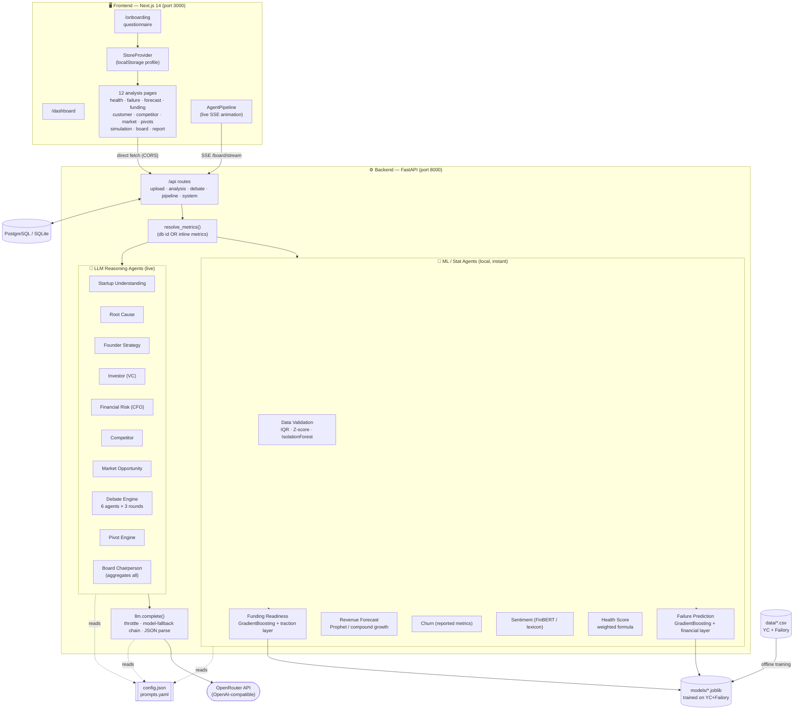

# VENTUREGENESIS — Architecture & System Design

> **AI-native Startup Operating System that acts as a virtual board of directors.**
> A founder answers a short questionnaire; VENTUREGENESIS then runs **16 agents** —
> a mix of **ML models trained on 6,089 real startups** and **live LLM reasoning agents** —
> to predict failure, forecast revenue, score funding readiness, debate the company in a
> simulated boardroom, recommend pivots, and issue a single board verdict with a
> downloadable executive report.

This document explains how everything fits together so you can present it confidently.

---

## 1. The 60-second pitch

Most "AI startup advisor" demos are one prompt to ChatGPT. VENTUREGENESIS is different:

- **Real ML, not vibes** — failure & funding predictions come from gradient-boosted models
  trained on the real YC + Failory company outcome dataset (AUC ≈ 0.85 / 0.79).
- **A real multi-agent system** — 16 specialised agents, including a 6-persona / 3-round
  boardroom **debate** and a **Chairperson** that synthesises everyone into one decision.
- **Live, observable work** — every agent streams its progress over SSE; the UI shows each
  agent light up, run, and finish with its real duration. If it's thinking, you see it think.
- **Config-driven & resilient** — scoring weights, prompts, industries, and simulation
  multipliers live in config files (hot-reloaded). A model-fallback chain keeps the LLM
  layer working even when a free model is rate-limited.

---

## 1.5. In plain English (how it works, no jargon)

Imagine a founder sits down in front of a panel of expert advisors. First they fill in a
short form about their company (money in, money out, customers, team, etc.). Then:

- A few advisors are **calculators** — they crunch the founder's numbers and compare them
  against **6,089 real startups we studied**, to estimate "how likely is this company to die"
  and "how likely is it to raise money". These are the **trained models** (math, instant).
- The rest of the advisors are **AI experts** (a real AI language model) — a strategist, a
  venture capitalist, a CFO, a competitor analyst, a market analyst — who each read the
  situation and give an opinion in words.
- Then six of them **argue it out in a boardroom** over three rounds, and a **Chairperson**
  listens to everyone and gives one final verdict: **invest, hold, pivot, or wind down**.

You watch all of this happen live on screen — each advisor "lights up" while thinking, then
shows a checkmark when done. Because the AI advisors really are thinking (calling a real AI
model over the internet), it genuinely takes a couple of minutes. Nothing is faked.

> A note on the words "model" and "agent":
> - A **model** here = a trained calculator (or the AI brain) that turns inputs into an answer.
> - An **agent** = one specialised worker with one job (e.g. "the CFO agent"). We have 16.

---

## 2. Tech stack at a glance

| Layer | Technology | Why |
|---|---|---|
| **Frontend** | Next.js 14 (App Router), React 18, TypeScript, Tailwind CSS | Fast SSR-capable UI, file-based routing |
| **Charts** | Recharts | Declarative gauges, area/bar/pie charts |
| **Motion** | Framer Motion | Count-up numbers, animated agent pipeline, page transitions |
| **Backend** | FastAPI (Python), Uvicorn | Async API, automatic OpenAPI docs, SSE streaming |
| **ORM / DB** | SQLAlchemy 2 + PostgreSQL (SQLite auto-fallback) | Persist startups, predictions, forecasts, debates, pivots |
| **ML** | scikit-learn (GradientBoosting), pandas, NumPy, joblib | Trained classifiers + data validation |
| **ML (optional)** | XGBoost, LightGBM, Prophet, CatBoost, SHAP, FinBERT | Heavier stack used if installed; graceful degradation otherwise |
| **LLM** | OpenRouter (OpenAI-compatible) via `httpx` | Powers all reasoning agents; model-agnostic |
| **Config** | `config.json` + `prompts.yaml` (hot reload) | Tune scoring/prompts without code changes |
| **Deploy** | Docker + Docker Compose (frontend, backend, postgres, redis) | One-command stack |

---

## 3. System design diagram



### ASCII fallback (if Mermaid doesn't render)

```
 FOUNDER
   │  fills questionnaire
   ▼
┌──────────────────────────── FRONTEND (Next.js 14, :3000) ─────────────────────────────┐
│  /onboarding ─► StoreProvider (localStorage)  ─►  12 analysis pages + AgentPipeline    │
└───────────────────────────────┬───────────────────────────────────────────────────────┘
              direct fetch (CORS) │  +  SSE stream for the live board pipeline
                                  ▼
┌──────────────────────────── BACKEND (FastAPI, :8000) ─────────────────────────────────┐
│  routes ─► resolve_metrics() ─┬─► ML/STAT AGENTS  (local, instant)                      │
│                               │      validation · failure · funding · forecast ·        │
│                               │      churn · sentiment · health                         │
│                               │            └── load ── models/*.joblib (trained)        │
│                               │                                                          │
│                               └─► LLM REASONING AGENTS (live) ─► llm.complete() ─► OpenRouter
│                                      understanding · root-cause · founder · investor ·   │
│                                      CFO · competitor · market · DEBATE(6×3) · pivots ·  │
│                                      BOARD chairperson                                   │
│  config.json + prompts.yaml (hot reload)            PostgreSQL / SQLite (persistence)    │
└────────────────────────────────────────────────────────────────────────────────────────┘
        ▲ offline:  data/*.csv (YC + Failory)  ──►  train.py  ──►  models/*.joblib
```

---

## 4. End-to-end data flow

1. **Onboarding** — the founder fills a 4-step questionnaire (industry, stage, founding
   year, team size, revenue/expenses/burn/cash, customers/growth/churn, funding/valuation,
   optional reviews). Runway is derived (`cash ÷ monthly burn`). No demo data is pre-filled.
2. **Profile stored** — saved to `localStorage` (and persisted to the DB via `POST /api/startups`).
   Every page sends this profile as `{ metrics: {...} }` (or `{ startup_id }`).
3. **`resolve_metrics()`** turns either reference into a plain metrics dict.
4. **ML agents** run locally and instantly (trained `.joblib` models + formulas).
5. **LLM agents** call `llm.complete()` → OpenRouter → parsed JSON.
6. **Board pipeline** (`POST /api/board/stream`) runs all 16 agents sequentially and
   **streams** `agent_start` / `agent_done` / `debate_message` / `complete` events (SSE),
   which drive the animated pipeline and live debate in the UI.
7. **Persistence** — predictions, forecasts, debate transcripts, and pivots are written to
   `predictions`, `forecasts`, `debates`, `pivot_results` tables.

---

## 5. The 16 agents

### 5.1 ML / statistical agents (run locally — real models, instant)

| # | Agent | Model / method | Output |
|---|---|---|---|
| 1 | **Data Validation** | pandas + IQR + Z-score + Isolation Forest (scikit-learn) | `data_quality_score`, missing fields, duplicates, outliers |
| 2 | **Failure Prediction** | **GradientBoostingClassifier** (trained) + transparent financial-risk layer | `failure_6m / 12m / 24m`, SHAP-style feature importance |
| 3 | **Funding Readiness** | **GradientBoostingClassifier** (trained) + traction layer | `funding_probability`, `investor_score` |
| 4 | **Revenue Forecast** | Prophet if installed, else deterministic compound-growth projection | `forecast_3m / 6m / 12m` + monthly series |
| 5 | **Customer Churn** | Transparent formula from founder-reported churn vs. growth | `churn_risk`, `retention_score` |
| 6 | **Customer Sentiment** | FinBERT (transformers) if installed, else lexicon | `sentiment`, distribution, per-review breakdown |
| 7 | **Startup Health** | Weighted scoring formula (weights in `config.json`) | `health_score` + 5 pillar breakdown |

**How the trained models work (the key talking point):**
- `train.py` loads `data/yc_companies_algolia.csv` + `data/failory_dataset_yc_format.csv`
  → **6,089 real companies** with genuine outcome labels (Active / Inactive / Acquired / Public).
- Features a founder can actually answer: **team size, company age, industry, stage**.
- Two `GradientBoostingClassifier`s:
  - `failure_model` → P(company becomes Inactive/dead) — **holdout AUC ≈ 0.85**.
  - `funding_model` → P(Acquired / Public / top-company) — **holdout AUC ≈ 0.79**.
- Saved as `models/*.joblib` (model + feature spec + industry map + metrics).
- At inference, the model gives a **data-driven base probability**, then a transparent layer
  adjusts it with the founder's *own* numbers (runway, churn, growth, burn). So the ML reflects
  both **6,000 real outcomes** and **your specific financials** — not a black box, not a guess.

### 5.2 LLM reasoning agents (run live via OpenRouter)

| # | Agent | Role |
|---|---|---|
| 8 | **Startup Understanding** | Classifies industry, business model, stage, growth profile |
| 9 | **Root Cause Analysis** | Turns failure-model feature importances into human-readable causes |
| 10 | **Founder Strategy** | Product / growth / feature roadmap recommendations |
| 11 | **Investor (VC Partner)** | Would-invest verdict + confidence + thesis + concerns |
| 12 | **Financial Risk (CFO)** | Runway, burn, cash-flow risk level + recommendation |
| 13 | **Competitor Intelligence** | Threat score + competitive gaps |
| 14 | **Market Opportunity** | Opportunity score + recommended market + trends |
| 15 | **Debate Engine** | 6 personas (Founder, Investor, Financial, Customer, Market, Competitor) debate over **3 rounds**: independent opinions → challenges → consensus |
| 16 | **Board Chairperson** | Aggregates a compacted view of *all* agents into a single `board_decision` (INVEST / HOLD / PIVOT / WIND_DOWN) + strategic actions, growth roadmap, risk mitigation, funding strategy |
| — | **Pivot Engine** | LLM proposes ≥3 pivots **with** estimated impact; rule-based scorer (config weights) ranks them and derives success/ROI/risk |

Every reasoning agent is required to return strict **JSON** matching a fixed schema, so the
frontend can render it reliably.

---

## 6. The LLM layer (`app/core/llm.py`) — the resilience story

A great hackathon detail: free LLM tiers are flaky, so the client is built to never silently fake data.

- **Provider:** OpenRouter (OpenAI-compatible `/chat/completions`) via `httpx`.
- **Configured model:** `OPENROUTER_MODEL` in `.env` (e.g. `google/gemma-4-31b-it:free`).
- **Model-fallback chain:** if the primary model returns 429/404/5xx, it rolls to the next
  free model (`openai/gpt-oss-20b:free`, `llama-3.3-70b`, `qwen3`, `glm-4.5-air`). All are
  **real LLMs** — this is resilience, not a mock substitute.
- **Last-good memory:** once a model succeeds, it's tried first next time (avoids re-paying
  for a saturated primary — cut a cold call from 88s → ~6s).
- **Self-throttle:** a token-bucket limits ~18 req/min to respect free-tier limits.
- **Bounded attempts + 45s timeout:** one logical call can't thrash for minutes; a slow
  upstream is abandoned and the next model is tried.
- **Strict JSON parsing:** tolerant extractor; malformed JSON triggers a retry.
- **No mock fallback:** if everything genuinely fails, the agent surfaces an error in the UI
  (the "FALLBACK ENGAGED" box) rather than inventing numbers.

---

## 7. Config-driven architecture (`app/config/`)

Nothing important is hard-coded. Both files **hot-reload** on every request (`VG_HOT_RELOAD`).

- **`config.json`** — `health_weights`, `pivot_scoring`, `simulation_multipliers`,
  `outlier_detection` thresholds, `failure_thresholds`, the `industries` taxonomy
  (matched to the trained model's encoding), the LLM model/temperature, and `mock_mode`.
- **`prompts.yaml`** — every agent's prompt in one place; edit reasoning behavior with zero code.
- Exposed/editable live via `GET/PUT /api/config`.

---

## 8. Key API endpoints

| Endpoint | Purpose |
|---|---|
| `POST /api/upload` | CSV upload → validation + understanding |
| `POST /api/startups` · `GET /api/startups` | Create / list startups |
| `POST /api/failure` · `…/funding` · `…/health` · `…/forecast` · `…/customer` | ML agents |
| `POST /api/competitor` · `…/market` · `…/strategy` | LLM intelligence agents |
| `POST /api/simulate` | Digital-twin scenario simulation |
| `POST /api/pivots` | Pivot generation → scoring → recommendation |
| `POST /api/debate` · `POST /api/debate/stream` | Boardroom debate (blocking / SSE) |
| `POST /api/board` · **`POST /api/board/stream`** | Full pipeline; the stream drives the live animated UI |
| `GET /api/config` · `GET /api/status` | Config & health |

All analysis endpoints accept either `{ "startup_id": <id> }` or `{ "metrics": {…} }`.

---

## 9. Database schema (SQLAlchemy)

```
startups (id, startup_name, industry, business_model, stage, founding_year,
          revenue, expenses, burn_rate, runway, customer_count, customer_growth,
          churn_rate, funding_amount, employee_count, valuation, status, created_at)
predictions   (id, startup_id→, failure_probability, funding_probability, health_score, created_at)
forecasts     (id, startup_id→, forecast_3m, forecast_6m, forecast_12m, created_at)
debates       (id, startup_id→, agent_name, round, message, stance, timestamp)
pivot_results (id, startup_id→, pivot_name, success_probability, roi, risk_score, created_at)
```

Postgres in production; if it's unreachable the app **auto-falls back to SQLite** so the demo never dies.

---

## 10. Frontend design — "Kinetic Instrument"

- **Dark instrument-panel aesthetic**: matte near-black ground, fixed-meaning signal hues
  (lime = good, aqua = steady, violet = compute, coral = risk), hairline grid, registration
  crosses, mono "specimen" labels.
- **Kinetic typography**: enormous condensed display numbers (Big Shoulders) that **count up**;
  small JetBrains Mono labels; Outfit for body.
- **Live agent pipeline**: on Board/Report, each agent renders pending → running (pulsing
  spinner) → done (✓ + real duration); the debate streams message-by-message; a clock shows
  elapsed time. Because the work is real, it takes real time — and you can watch it.
- Charts: radial gauges with concentric ticks, diverging SHAP bars, accelerating forecast areas,
  sentiment donut — all from one shared chart theme.

---

## 11. Repository map

```
venturegenesis/
├── backend/
│   ├── app/
│   │   ├── main.py                 # FastAPI app + CORS + routers
│   │   ├── core/
│   │   │   ├── config.py           # .env + config.json/prompts.yaml loader (hot reload)
│   │   │   └── llm.py              # OpenRouter client: throttle, fallback chain, JSON parse
│   │   ├── config/
│   │   │   ├── config.json         # weights, multipliers, thresholds, industries, llm
│   │   │   └── prompts.yaml        # all agent prompts
│   │   ├── db/                     # SQLAlchemy database, models, pydantic schemas
│   │   ├── agents/
│   │   │   ├── data_validation.py
│   │   │   ├── startup_understanding.py
│   │   │   ├── debate_engine.py    # 6 agents × 3 rounds, streaming
│   │   │   ├── board.py            # aggregates everything → verdict
│   │   │   ├── ml/                 # failure, funding, forecast, churn, sentiment, health
│   │   │   └── intelligence/       # root_cause, founder, investor, financial, competitor, market
│   │   ├── ml_training/
│   │   │   ├── features.py         # shared feature engineering (train == inference)
│   │   │   ├── train.py            # trains the two GradientBoosting models
│   │   │   └── loader.py           # loads models/*.joblib (cached)
│   │   ├── simulation/             # digital_twin, scenario engine, pivot pipeline
│   │   └── api/routes/             # upload, analysis, debate, pipeline, system
│   ├── seed.py                     # imports real YC companies as reference data
│   └── requirements*.txt
├── frontend/
│   ├── app/                        # 12 routes + onboarding + layout + fonts + globals.css
│   ├── components/                 # ui, Sidebar, Gauge, AgentPipeline, instrument (SVG), ProfileGuard
│   └── lib/                        # api.ts (incl. SSE), store.tsx, chartTheme.ts
├── models/                         # trained *.joblib (generated by train.py)
├── data/                           # YC + Failory CSV datasets
└── docker-compose.yml              # frontend + backend + postgres + redis
```

---

## 12. How to run (recap)

```bash
# Backend
cd backend && python -m venv .venv && source .venv/bin/activate
pip install -r requirements-min.txt
python -m app.ml_training.train     # train models on real data
python seed.py                      # import real YC reference companies
uvicorn app.main:app --reload --port 8000

# Frontend (separate terminal)
cd frontend && npm install && npm run dev   # http://localhost:3000
```

Set `OPENROUTER_API_KEY` (and optionally `OPENROUTER_MODEL`) in `.env` to power the LLM agents.
Open the app → complete the questionnaire → explore the pages → **Convene the Board**.

---

## 13. Talking points for judges

1. **"It's a real multi-agent system, not one prompt."** 16 agents, a 3-round debate, and a
   Chairperson that aggregates them.
2. **"The predictions are trained on 6,000 real startup outcomes."** Show the AUCs and the
   YC/Failory dataset; explain the base-probability + financial-layer blend.
3. **"You can watch the agents work."** The streaming pipeline proves the work is real and live.
4. **"It's resilient and config-driven."** Model-fallback chain, hot-reloaded weights/prompts,
   SQLite fallback, graceful per-agent error handling — no fabricated data anywhere.
5. **"It degrades gracefully."** Missing optional ML libs → documented real-compute paths
   (e.g. lexicon sentiment); LLM down → visible error, **never fake output** (no mock mode).

---

## Appendix A — Plain-English glossary

Everything a non-ML person needs to follow the project. Skim it before a demo.

### Machine-learning terms

- **Model** — a program that has "learned" a pattern from past data and can make a prediction
  on new data. Ours learned from 6,089 real startups what tends to precede failure/success.
- **Training** — the one-time process of showing the model lots of past examples (with known
  outcomes) so it can find the pattern. We run `python -m app.ml_training.train`.
- **Classifier** — a model whose answer is a category/probability (e.g. "78% likely to fail")
  rather than a free-form number.
- **Gradient Boosting (GradientBoostingClassifier)** — the specific ML technique we use. It
  builds many tiny decision trees one after another, each fixing the previous one's mistakes.
  Think "a committee of simple yes/no rules that vote". Reliable and strong on tabular data.
  (XGBoost, LightGBM, CatBoost are faster industrial versions of the same idea.)
- **Feature** — one input the model looks at (e.g. team size, company age, industry, stage).
- **Feature importance** — how much each feature influenced the prediction. Lets us say
  *why*, not just *what*.
- **AUC (Area Under the ROC Curve)** — a score from 0.5 to 1.0 measuring how well a classifier
  separates the two outcomes. **0.5 = random guessing, 1.0 = perfect.** Our failure model
  scores **~0.85** and funding **~0.79** on data it had never seen — solidly good for messy
  real-world startup data. (Quote this number to judges.)
- **Holdout / test set** — data the model was NOT trained on, used to fairly check it. AUC is
  always reported on the holdout, so it reflects real performance, not memorisation.
- **SHAP (SHapley Additive exPlanations)** — a method that explains a single prediction by
  saying how many points each feature pushed the risk up or down. It's the math behind the
  "why is this startup risky" bars. (From cooperative game theory — fairly splitting "credit".)
- **Prophet** — Facebook's time-series forecasting model; given past monthly revenue it
  projects future months. If it isn't installed we use a plain compound-growth projection
  from the founder's real numbers.
- **FinBERT** — a language model fine-tuned to judge financial-text sentiment
  (positive/neutral/negative). Used on customer reviews. Falls back to a keyword lexicon.
- **Isolation Forest** — an algorithm that flags **outliers** (weird data points) by seeing how
  easily a point can be "isolated" by random splits. Used in data validation.
- **IQR (Inter-Quartile Range)** — the spread of the middle 50% of values; points far outside
  it are likely outliers. **Z-score** — how many standard deviations a value is from the
  average; big = outlier. We combine IQR + Z-score + Isolation Forest for robustness.
- **Data quality score** — our 0-100 summary of how clean the uploaded data is (penalises
  missing values, duplicates, outliers).

### AI / LLM terms

- **LLM (Large Language Model)** — an AI trained on huge amounts of text that can read a
  situation and write a reasoned response (e.g. GPT, Gemma, Llama). It powers the "advisor"
  agents that produce opinions in words.
- **Agent** — one LLM (or model) given a specific role, prompt, and output format. "The CFO
  agent" = an LLM told to act as a CFO and reply in a fixed JSON shape.
- **Multi-agent system** — many agents working together (and here, debating) rather than one
  prompt doing everything.
- **Prompt** — the instructions we send the LLM. All ours live in `prompts.yaml`.
- **OpenRouter** — a single API that routes to many LLM providers (OpenAI, Google, Meta…). We
  use it so the app isn't locked to one vendor; swapping models is a config change.
- **Token** — the unit LLMs read/write text in (~¾ of a word). `max_tokens` caps response length.
- **Rate limit / 429** — providers cap how many requests you can make per minute. "429" is the
  "too many requests" error. Free tiers are tight (~20/min), which is why a full board run is
  paced and takes a few minutes.
- **Model-fallback chain** — if our chosen model is busy (429), we automatically try the next
  *real* model. This is resilience, **not** fake data.
- **JSON** — the structured text format every agent must reply in, so the app can render it.

### Web / system terms

- **API** — the backend's set of URLs the frontend calls to get work done (e.g. `/api/board`).
- **FastAPI / Uvicorn** — the Python web framework and server running our backend.
- **Next.js / React** — the framework powering the frontend (pages, components, interactivity).
- **SSE (Server-Sent Events)** — a way for the backend to push a live stream of updates to the
  browser over one connection. It's how each agent's progress appears in real time.
- **CORS** — browser security that controls which sites may call an API. We enable it so the
  frontend can call the backend directly (this also avoids the dev-proxy timing out long calls).
- **ORM / SQLAlchemy** — lets us work with the database using Python objects instead of raw SQL.
- **Hot reload** — config/prompt files are re-read on every request, so edits apply instantly
  with no restart.

### Startup / finance terms (used by the agents)

- **Burn rate** — how much cash the company spends per month.
- **Runway** — how many months of cash are left = `cash ÷ monthly burn`. Under ~6 = danger.
- **Churn rate** — the % of customers who leave each month. High churn kills recurring revenue.
- **Valuation** — what the company is currently considered to be worth.
- **ROI (Return on Investment)** — gain relative to cost; used to rank pivots.
- **Pivot** — a deliberate change of business direction (e.g. B2C app → B2B platform).
- **Board verdict** — the final aggregated call: **INVEST / HOLD / PIVOT / WIND_DOWN**.

---

## Appendix B — Frequently asked (judge) questions

- **"Is the AI actually running or is it canned?"** Actually running — every reasoning agent
  makes a live OpenRouter call; there is no mock/offline mode in the codebase. That's why it
  takes real time, and why you can watch each agent in the pipeline.
- **"Where does the prediction accuracy come from?"** Two GradientBoosting models trained on
  6,089 real YC + Failory companies; holdout AUC ≈ 0.85 (failure) and ≈ 0.79 (funding).
- **"What if the model is missing or the LLM fails?"** The agent surfaces a clear error in the
  UI rather than inventing numbers — by design, nothing is faked.
